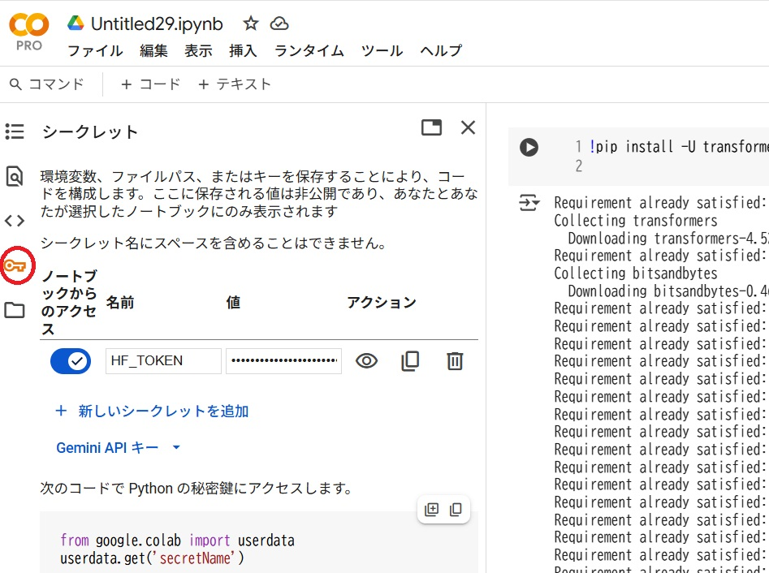

# llama3 をcolaboratory GPU環境で実行する
最近、ローカルLLMかつ、cpuでも動作するllamaだが、やはりGPUのほうがはるかに速い。これを
利用するには、以下の通りHugging face上の該当llamaへのアクセス権を登録してから、colab上
から呼び出す。  
参考リンク
https://note.com/npaka/n/n73b0786f48e9

### hugging faceで何ができるか
以下が詳しい
https://colab.research.google.com/github/yamada-kd/binds-training/blob/main/notebook/tensorflow_07.ipynb

### 1. モデルカード
Hugging faceはモデル毎にアクセス権を取得する必要がある。このアクセス権がモデルカード
例えば、上記のモデルカードリンクでllama3のモデルページに入るので、下部のほうのアクセス権登録
のリンクから必要情報を登録する。ただし、アクセス権が付与されるまで、数十分かかるので注意。  
アクセス権が付与されると以下のようなメールが送られてくる  
hugging faceからのモデルカード権限取得の手順は以下が詳しい
https://qiita.com/menon/items/51f586a04c6595f1a6c3

[Access granted] Your request to access model meta-llama/Meta-Llama-Guard-2-8B has been accepted

### 2. hugging face API keyのcolabへの登録
1. 以下のリンクに従って、hugging faceのアクセストークンをgenerateしてコピーする
https://zenn.dev/protoout/articles/73-hugging-face-setup

2. colaboratoryからColabのシークレットマネージャーの「HF_TOKEN」にアクセストークンを登録。
なお、notebookを新規で開く都度、トークンの利用がoffになっているので、以下のコードをuploadするまえに
onにする

### 3. llama3のプログラムを実行
以下のコードをcolabから実行する  
https://note.com/npaka/n/n73b0786f48e9  

[llama3_colab](llama3_colab.ipynb)をcolabにアップロードして実行  

